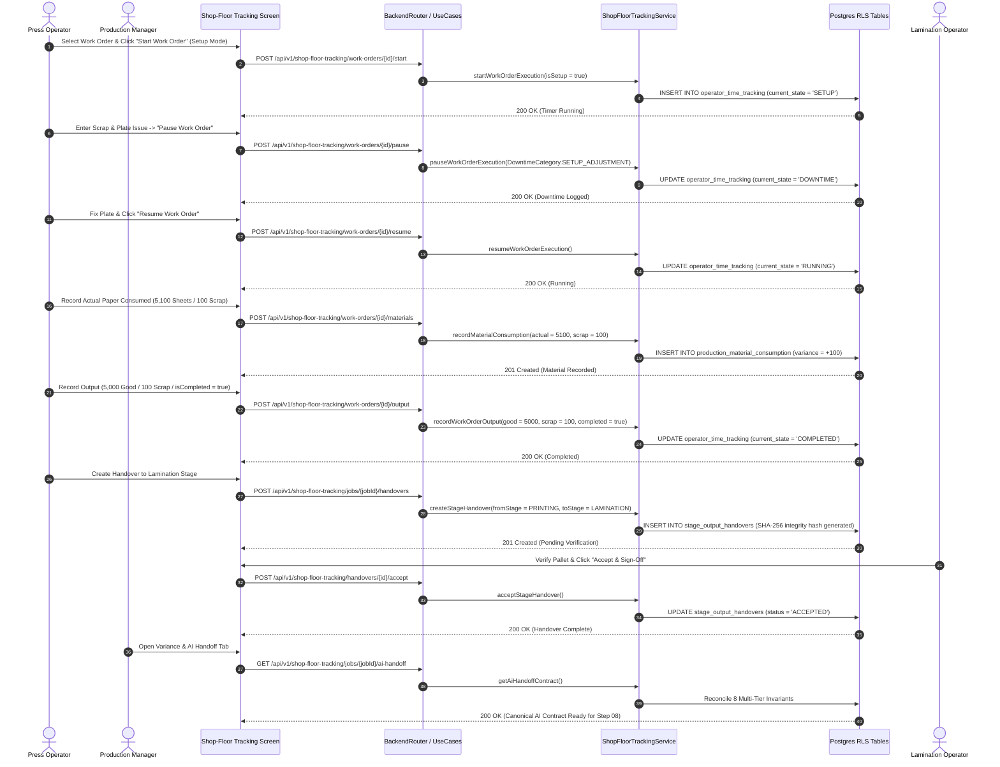

# MODULE 17 — STEP 07: USER JOURNEY VERIFICATION

---

### Step-by-Step Operator & Manager Execution Flow

```mermaid
sequenceDiagram
    autonumber
    actor OP as Press Operator
    actor MGR as Production Manager
    participant UI as Shop-Floor Tracking Screen
    participant API as BackendRouter / UseCases
    participant SVC as ShopFloorTrackingService
    participant DB as Postgres RLS Tables

    OP->>UI: Select Work Order & Click "Start Work Order" (Setup Mode)
    UI->>API: POST /api/v1/shop-floor-tracking/work-orders/{id}/start
    API->>SVC: startWorkOrderExecution(isSetup = true)
    SVC->>DB: INSERT INTO operator_time_tracking (current_state = 'SETUP')
    DB-->>UI: 200 OK (Timer Running)

    OP->>UI: Enter Scrap & Plate Issue -> "Pause Work Order"
    UI->>API: POST /api/v1/shop-floor-tracking/work-orders/{id}/pause
    API->>SVC: pauseWorkOrderExecution(DowntimeCategory.SETUP_ADJUSTMENT)
    SVC->>DB: UPDATE operator_time_tracking (current_state = 'DOWNTIME')
    DB-->>UI: 200 OK (Downtime Logged)

    OP->>UI: Fix Plate & Click "Resume Work Order"
    UI->>API: POST /api/v1/shop-floor-tracking/work-orders/{id}/resume
    API->>SVC: resumeWorkOrderExecution()
    SVC->>DB: UPDATE operator_time_tracking (current_state = 'RUNNING')
    DB-->>UI: 200 OK (Running)

    OP->>UI: Record Actual Paper Consumed (5,100 Sheets / 100 Scrap)
    UI->>API: POST /api/v1/shop-floor-tracking/work-orders/{id}/materials
    API->>SVC: recordMaterialConsumption(actual = 5100, scrap = 100)
    SVC->>DB: INSERT INTO production_material_consumption (variance = +100)
    DB-->>UI: 201 Created (Material Recorded)

    OP->>UI: Record Output (5,000 Good / 100 Scrap / isCompleted = true)
    UI->>API: POST /api/v1/shop-floor-tracking/work-orders/{id}/output
    API->>SVC: recordWorkOrderOutput(good = 5000, scrap = 100, completed = true)
    SVC->>DB: UPDATE operator_time_tracking (current_state = 'COMPLETED')
    DB-->>UI: 200 OK (Completed)

    OP->>UI: Create Handover to Lamination Stage
    UI->>API: POST /api/v1/shop-floor-tracking/jobs/{jobId}/handovers
    API->>SVC: createStageHandover(fromStage = PRINTING, toStage = LAMINATION)
    SVC->>DB: INSERT INTO stage_output_handovers (SHA-256 integrity hash generated)
    DB-->>UI: 201 Created (Pending Verification)

    actor OP2 as Lamination Operator
    OP2->>UI: Verify Pallet & Click "Accept & Sign-Off"
    UI->>API: POST /api/v1/shop-floor-tracking/handovers/{id}/accept
    API->>SVC: acceptStageHandover()
    SVC->>DB: UPDATE stage_output_handovers (status = 'ACCEPTED')
    DB-->>UI: 200 OK (Handover Complete)

    MGR->>UI: Open Variance & AI Handoff Tab
    UI->>API: GET /api/v1/shop-floor-tracking/jobs/{jobId}/ai-handoff
    API->>SVC: getAiHandoffContract()
    SVC->>DB: Reconcile 8 Multi-Tier Invariants
    DB-->>UI: 200 OK (Canonical AI Contract Ready for Step 08)
```
