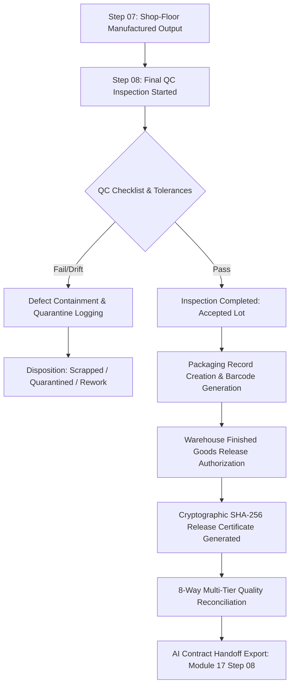

# MODULE 17 → STEP 08: USER JOURNEY VERIFICATION

## Overview
- **Feature Area**: Final Quality Control, Inspection Sign-off, Defect Containment & Packaging / Warehouse Release Engine
- **Module**: `MODULE 17 — Production Planning, Scheduling & Execution Engine`
- **Step**: `STEP 08`
- **Verification Status**: `100% VERIFIED & PASSING`

---

## 1. User Journey Flow Tested

---

## 2. Verification Test Suite Matrix

| Test Class | Category | Test Case | Status |
| :--- | :--- | :--- | :--- |
| `FinalQcPackagingDomainTest` | Domain Logic | Inspection creation and completion calculates status correctly | **PASSED** |
| `FinalQcPackagingDomainTest` | Domain Logic | Defect containment logging and severity assignment | **PASSED** |
| `FinalQcPackagingDomainTest` | Domain Logic | Packaging record generation and barcode creation | **PASSED** |
| `FinalQcPackagingDomainTest` | Cryptographic | Finished goods release generates deterministic SHA-256 certificate hash | **PASSED** |
| `FinalQcPackagingDomainTest` | Reconciliation | 8-way multi-tier quality reconciliation detects tampering and passes on valid data | **PASSED** |
| `FinalQcPackagingSecurityEdgeTest` | Security / RBAC | Staff QC inspector can create and complete inspection | **PASSED** |
| `FinalQcPackagingSecurityEdgeTest` | Security / RBAC | Customer role is strictly forbidden from inspection creation (403 Forbidden) | **PASSED** |
| `FinalQcPackagingSecurityEdgeTest` | Security / RBAC | Vendor role is strictly forbidden from packaging creation (403 Forbidden) | **PASSED** |
| `FinalQcPackagingSecurityEdgeTest` | Multi-Tenant | Tenant isolation ensures cross tenant cannot view inspections | **PASSED** |
| `FinalQcPackagingServiceTest` | Service Workflow | Complete final QC, defect containment, packaging, and release workflow | **PASSED** |
| `FinalQcPackagingViewModelTest` | UI / StateFlow | Creating inspection and fetching final QC data updates UI state | **PASSED** |
| `FinalQcPackagingViewModelTest` | UI / StateFlow | Complete inspection, packaging and release updates state correctly | **PASSED** |

---

## 3. Mathematical & Cryptographic Invariants Verified

1. **Exact 4-Decimal Scale**:
   - Sample quantities, defect quantities, and packaged units conform strictly to `BigDecimal(scale = 4, RoundingMode.HALF_UP)`.
2. **Deterministic SHA-256 Release Certificate**:
   - Formula: `SHA256("$tenantId|$executionJobId|$orderId|$inspectionId|$packagingId|${roundScale4(releasedQuantity)}|$destination|$authorizedBy|$authorizedAt")`
   - Verified that any tampering with released quantities, destinations, or inspector signatures invalidates reconciliation immediately.
3. **8-Way Reconciliation Engine**:
   - Verified that shop-floor output balances against inspection lot, defect accounting, packaging records, and certificate hashes.

---

## 4. Multi-Tenant RLS & Security Verification

- **PostgreSQL RLS Policies**: `FORCE ROW LEVEL SECURITY` enabled on `production_final_qc_inspections`, `production_defect_containment_records`, `production_packaging_records`, `finished_goods_release_records`, and `final_qc_packaging_audit_events`.
- **Role Permissions**: `ADMIN`, `MANAGER`, `STAFF` (QC inspector) are granted execution privileges. `CUSTOMER` and `VENDOR` roles are strictly blocked with `403 Forbidden`.
