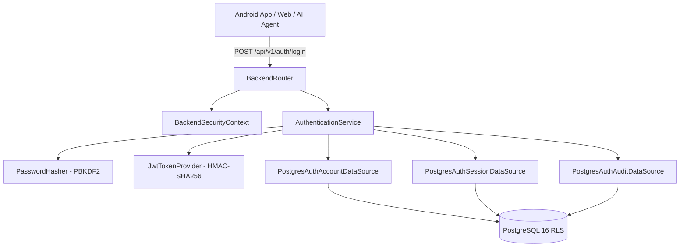

# Sucharu Pro — Authentication & Identity Architecture

## Overview
The Authentication & Identity foundation of Sucharu Pro establishes a server-authoritative, multi-tenant security architecture designed for commercial printing enterprise operations and future AI agent workflows.

---

## Architectural Principles

1. **Server-Side Authority**:
   - All tenant context, user identities, roles, and permissions are determined exclusively on the backend server from cryptographically signed and verified JWT access tokens.
   - Client headers such as `X-Project-ID`, `X-User-ID`, `X-User-Role`, and `X-Permissions` are strictly ignored for authorization decisions.

2. **Multi-Tenant Isolation & Row-Level Security (RLS)**:
   - Tenant isolation is enforced at the database layer via PostgreSQL Row-Level Security (`app.current_project_id`).
   - Every authentication, session, and audit query operates within explicit transaction-scoped tenant parameters.

3. **Cryptographic Token Separation**:
   - **Access Tokens**: Short-lived (e.g. 15 minutes), HMAC-SHA256 signed JSON Web Tokens (JWT) containing userId, projectId, username, role, permissions, and session ID.
   - **Refresh Tokens**: High-entropy opaque random strings (256-bit). Server stores ONLY the SHA-256 fingerprint hash. Plaintext refresh tokens are never persisted.

4. **Extensible RBAC Model**:
   - Built-in roles: `GUEST`, `CUSTOMER`, `AFFILIATE`, `STAFF`, `MANAGER`, `ADMIN`.
   - Extensible role system ready for: `ACCOUNTS`, `WAREHOUSE`, `QC_INSPECTOR`, `LOGISTICS`, `VENDOR`, `SUPER_ADMIN`, and autonomous `AI_AGENT`.

---

## Component Topology

---

## Identity Flow

1. **Authentication**: Client submits credentials -> `AuthenticationService` verifies against salted `PBKDF2WithHmacSHA256` hash -> generates JWT access token and opaque refresh token -> persists session and audit log.
2. **Authorized Request**: Client attaches `Authorization: Bearer <jwt>` -> `BackendSecurityContext` validates HMAC signature, expiration, issuer, audience, and extracts trusted `AuthenticatedPrincipal` -> sets `TenantContext.set(principal.projectId)` and configures PostgreSQL RLS.
3. **Token Rotation**: Client calls `POST /api/v1/auth/refresh` -> server validates hash, verifies session is active, detects replays, generates new token pair, rotates refresh token hash in DB -> invalidates old token.
4. **Revocation & Logout**: Server marks session status as `REVOKED` -> future refresh requests rejected immediately.
